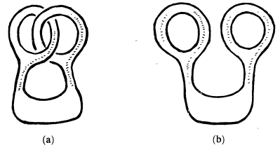

> Cette page est une version markdown/html de la bibliographie destinée aux étudiant(e)s de L3 et magistère de mathématiques de Nancy, qui est disponible

## Comment utiliser cette bibliographie

- Les sous-sections correspondent plus ou moins aux UE de la L3.

- À chaque fois, la ou les premières première référence sont encadrées
  et particulièrement recommandées. Souvent, il s'agit de références
  incontournables, plébiscitées par des générations successives
  d'étudiants et d'enseignants.

- La liste contient des ouvrages d'autrices ou auteurs étrangers. Il est
  extrêmement enrichissant de les lire ou au moins de les parcourir afin
  de réaliser la variété de points de vue existants.

- Les livres sont de différentes sortes : certains sont juste de bons
  supports de révisions, d'autres vous apprendront vraiment des
  mathématiques. À trier suivant les besoins du moment.

- La liste est (trop) longue. Lire quelques livres cités ici (ou
  d'autres) est déjà très bien, même juste deux ou trois. Par contre, ne
  lire _aucun_ livre de mathématiques pendant son année de L3 serait
  dommage voire considéré comme un peu anormal.

## Comment ne pas utiliser cette bibliographie

- Lire les livres dans l'ordre de la liste, en commençant par le début.

- Commencer par la fin, par les ouvrages avancés, et être dégoûté.

- Ne lire aucun livre.

- Ne pas lire la liste du tout.

## Bibliographie pour la L3

### Fondements, redécouverte du programme de L1-L2 ou CPGE

- Richard Courant, Herbert Robbins, _Qu'est-ce que les mathématiques ?_

  > Enfin traduit en français, par Marie Anglade et Karin Py. En
  > discutant entre collègues (français mais surtout internationaux), on
  > constate que beaucoup ont été marqués par ce livre dans leur
  > jeunesse. D'une richesse exceptionnelle, l'ouvrage démarre au niveau
  > bac+1 mais contient de nombreux thèmes de niveau bac+3.

- Bertrand Hauchecorne, _Les contre-exemples en mathématiques_

  > 522 contre-exemples couvrant la plupart des chapitres des deux
  > premières années. (Manque un peu de contre-exemples en
  > probabilités.)

- Walter Rudin, _Principes d'analyse mathématique_

  > Traduit de l'anglais par Guy Auliac. Surnommé le baby Rudin par les
  > anglo-saxons, cet excellent ouvrage prend l'analyse à son début,
  > introduit très tôt des notions topologiques et n'est manifestement
  > pas soumis au respect de programmes officiels. Il traite l'intégrale
  > de Riemann-Stieltjes, les familles équicontinues, le théorème de
  > Stone-Weierstrass, les séries de Fourier et termine avec un peu de
  > calcul différentiel et de théorie de la mesure ce qui réalise une
  > transition parfaite avec la L3.

- Paul Halmos, _L'algèbre linéaire en problèmes_

  > Pour se poser des questions élémentaires et parfois destabilisantes
  > sur le programme d'algèbre linéaire des deux premières années et un
  > peu plus (dualité, matrices hermitiennes, formes quadratiques).

- R. Graham, D. Knuth, O. Patashnik, _Mathématiques concrètes_

  > Traduit de l'anglais par Alain Denise. Combinatoire, fonctions
  > génératrices, probabilités discrètes, calcul asymptotique.
  > Totalement orthogonal au style français et fascinant par la variété
  > de sujets traités et d'exercices proposés, des bases de bac+1
  > jusqu'à des problèmes très difficiles.

- H. Gianella, R. Krust, F. Taieb, N. Tosel, _Problèmes choisis de
  mathématiques supérieures_

  > Un recueil de très jolis problèmes dont la particularité est d'être
  > accessibles en fin de L1 ou de maths sup. Les problèmes effleurent
  > des thèmes qui seront développés en L3, M1 ou après.

- Rached Mneimné, _Réduction des endomorphismes, tableaux de Young, cône
  nilpotent_

  > Livre atypique, à la structure au mieux fractale, au pire
  > franchement inexistante. Énormément d'exercices originaux qui
  > anticipent sur des concepts évolués qui ne seront jamais expliqués
  > ni même présentés dans le livre. À la fois frustrant et excitant.

- Alexei Kostrikin et Youri Manin, _Algèbre et géométrie linéaires_

  > Très beau cours de l'université de Moscou, traduit par Marc-Henri
  > Dehon, couvrant l'algèbre linéaire jusqu'à bac+4. Calcul matriciel,
  > dualité, sommes et quotients, structure des endomorphismes. Espaces
  > euclidiens ou hermitiens, espaces symplectiques. Géométrie affine et
  > géométrie projective. Algèbre tensorielle.

- Sheldon Axler, _Linear Algebra Done Right_

  > Grand classique anglo-saxon. Espaces vectoriels, sous-espaces,
  > quotients, applications linéaires, dualité. Réduction, espaces
  > euclidiens et hermitiens, théorème spectral. Puis, des thèmes plus
  > avancés : réduite de Jordan, formes quadratiques, produit tensoriel.

- Paul Halmos, _Introduction à la théorie des ensembles_

  > Traduit de l'anglais par Jean Gardelle. Présentation des axiomes,
  > lemme de Zorn et axiome du choix, bon ordre et récurrence
  > transfinie, ordinaux et cardinaux, théorème de Schröder-Bernstein,
  > ensembles dénombrables. Extrait de la préface:
  >
  > > _Tous les mathématiciens sont d'accord pour penser qu'un
  > > mathématicien doit connaître quelque peu la théorie des ensembles;
  > > le désaccord commence lorsque l'on cherche à définir ce quelque
  > > peu._

---

### Algèbre

- Daniel Perrin, Cours d'algèbre.

  > On ne présente plus le Perrin. Toute l'algèbre de L3 ou d'agreg est
  > dans le Perrin. Les suites exactes ? Dans le Perrin, troisième page.
  > [^1] À lire crayon à la main, certaines preuves sont rapides (bien
  > que toujours correctes). Les exercices sont corrigés dans des
  > ouvrages de Francinou et Gianella (sans Nicolas), et Ortiz.

- Rached Mneimné, Alain Debreil, _Le groupe symétrique $\mathfrak S_4$
  et ses métamorphoses_

  > Parfait pour se forger une bonne intuition sur la manipulation de
  > groupes grâce à $\mathfrak S_4$, groupe ayant un très bon rapport
  > richesse/cardinal. Après, il y a $\mathfrak S_5$ et l'époustouflant
  > groupe simple $\mathfrak A_5$ mais c'est une autre paire de manches.

- Josette Calais, _Éléments de théorie des groupes_

  > Référence classique, va plus loin que le Perrin sur les groupes :
  > groupes nilpotents et résolubles, théorème de Jordan-Hölder,
  > structure des groupes abéliens de type fini, groupes libres,
  > générateurs et relations. L'autrice a également publié des livres
  > sur les anneaux et sur les extensions de corps et la théorie de
  > Galois.

- Joseph J. Rotman, _A First Course in Abstract Algebra_

  > Livre de référence anglo-saxon. Une petite moitié de Perrin en 600
  > pages. Fondements en algèbre et arithmétique, groupes et actions de
  > groupes, anneaux commutatifs, corps, un peu d'algèbre linéaire.
  > Commence bien plus bas que le Perrin, est beaucoup plus détaillé,
  > finit un peu plus loin sur les anneaux commutatifs (anneaux
  > noethériens, variétés, bases de Gröbner).

- Philippe Caldero, Jerôme Germoni, _Histoires hédonistes de groupes et
  de géométrie_

  > Affectueusement surnommé H2G2 par les agrégatifs. Contient des
  > thèmes d'algèbre et géométrie accessibles au niveau L3 qui
  > permettent de prendre conscience de l'intrication entre algèbre et
  > géométrie : la géométrie est l'étude de groupes de transformations,
  > et les groupes n'existent réellement qu'au travers d'opérations sur
  > des objets géométriques. Réédité dans une nouvelle édition avec
  > corrections.

- G. Hardy, E. Wright, _Introduction à la théorie des nombres_

  > Traduit de l'anglais par François Sauvageot. Ce livre a la
  > particularité de n'utiliser quasiment que des techniques
  > élémentaires : pas d'analyse complexe, pas de théorie générale sur
  > les corps de nombres. Il est lisible dès le début de la L3.
  > Congruences, fractions continues et approximations diophantiennes,
  > nombres premiers, suites de Farey, équations diophantiennes, corps
  > quadratiques, fonctions arithmétiques\...

##### Transition L3-M1

- John Meier, _Groups, graphs and trees_

  > Très différent des ouvrages français, style plus informel, mais
  > plein de jolies choses. Graphes de Cayley, groupes engendrés par des
  > réflexions, groupes libres et présentations, croissance des groupes.
  > Exemples importants : lamplighter group, groupe de Thompson, groupe
  > infini de torsion mais de type fini.

- Kenneth Ireland, Michael Rosen, _A Classical Introduction to Modern
  Number Theory_

  > Une des références incontestées, mais le niveau correspond plus au
  > M1, passés les quatre premiers chapitres.

---

### Analyse, intégration, analyse fonctionnelle, Fourier

- Olivier Garet et Aline Kurtzmann, _De l'intégration aux probabilités_

  > Écrit par deux enseignants-chercheurs de l'IECL et devenu récemment
  > assez populaire à l'agrégation. La première partie commence par des
  > rappels sur les limites supérieures et inférieures et l'analyse
  > asymptotique. Elle traite ensuite les tribus, mesures et de
  > l'intégrale de Lebesgue avec les grands théorèmes d'analyse
  > associés. La seconde partie de l'ouvrage traite des probabilités
  > dans un cadre mesurable, voir la section associée.

- Georges Skandalis, _Topologie et analyse fonctionnelle_

  > La topologie à la botte de l'analyse. Pour de la vraie topologie,
  > voir la section correspondante. Plus sérieusement, livre vivement
  > conseillé pour la L3, écrit par un grand spécialiste des algèbres
  > d'opérateurs et de géométrie non commutative.

- Walter Rudin, _Analyse réelle et complexe_

  > Ancien incontournable d'agreg. La première moitié du livre fait la
  > théorie de la mesure, l'intégration de Lebesgue, les espaces $L^p$
  > et le début de la théorie de Fourier.

- Bernad Gelbaum, John Olmsted, _Counterexamples in Analysis_

  > Version plus avancée des livres de contre-exemples présentés en
  > début de liste. Contre-exemples en analyse classique mais aussi en
  > théorie de la mesure, en topologie générale, métrique, en topologie
  > du plan, en analyse fonctionnelle.

- B.M. Makarov, M.G. Goluzina, A.A. Lodkin, A.N. Podkorytov, _Problèmes
  d'analyse réelle_

  > Plus de 1000 problèmes. Le début du livre est accessible en L2 et
  > CPGE, la fin est plus avancée, niveau L3 et plus : mesures de
  > Hausdorff, théorie ergodique\...

- Cédric Villani, _Intégration et analyse de Fourier_

  > Polycopié. Cours suivi par l'auteur de cette liste en 2003-2004.
  > Disponible en ligne à l'adresse
  > <https://www.cedricvillani.org/sites/dev/files/old_images/2013/03/IAF.pdf>
  > Assez avancé sur certains chapitres, nombreuses ouvertures.

##### Transition L3-M1:

- Hervé Queffélec, Claude Zuily, _Analyse pour l'agrégation_

  > Ouvrage de synthèse très riche. Un genre de Gourdon bac+3/bac+4 en
  > analyse.

- Denis Choimet, Hervé Queffélec, _Analyse mathématique. Grands
  théorèmes du vingtième siècle_

  > Le vingtième siècle n'est pas seulement le siècle de l'algèbre et de
  > la géométrie algébrique et arithmétique. Ce livre expose de la très
  > belle et récente analyse réelle et complexe, accessible en fin de L3
  > mais dépassant assez vite le niveau de l'agrégation.

- Frédéric Paulin, _Topologie, analyse et calcul différentiel_

  > Cour de premier semestre de première année à Ulm, disponible à
  > l'adresse
  > <https://www.imo.universite-paris-saclay.fr/~frederic.paulin/notescours/cours_analyseI.pdf>.
  > Topologie quotient, espaces vectoriels topologiques, espaces de
  > Fréchet, Banach et Hilbert, point fixe, Arzela-Ascoli, Baire,
  > topologie faible, théorie spectrale des auto-adjoints, inversion
  > locale et Cauchy-Lipschitz\... Attention, il ne plaisante pas.

##### Remarque de fin de section :

à plus haut niveau, l'analyse harmonique se fait sur les groupes de Lie
(et pas juste sur $\mathbb R^n$). La théorie de Fourier, elle, est en
réalité une théorie de dualité très générale. On la retrouve même en
algèbre très abstraite.

::: center
$\star$\
$\star\quad\star$
:::

### Calcul différentiel, équations différentielles

::: mdframed

- François Rouvière, _Petit guide de calcul différentiel_

  > Affectueusement surnommé PGCD par les agrégatifs. Panorama de cours
  > suivis d'exercices d'entraînement puis de problèmes plus difficiles
  > et souvent passionnants. Contenu : normes, différentielles, point
  > fixe, inversion locale et sous-variétés, différentielles secondes,
  > problèmes d'extrema. Pas d'équations différentielles.
  > :::

- John Hubbard, Beverly West, _Équations différentielles et systèmes
  dynamiques_

  > Traduit de l'anglais et adapté par Véronique Gautheron. Magnifique
  > ouvrage sur l'étude qualitative des équations différentielles et
  > systèmes dynamiques : portraits de phase, isoclines, entonnoirs et
  > anti-entonnoirs, stabilité des solutions.

##### Transition L3-M1:

- Henri Cartan, _Calcul différentiel_

  > Cours solide de calcul différentiel dans les Banach. Contient du
  > calcul extérieur et des formes différentielles, niveau M1. Exercices
  > corrigés dans un livre de F. Rideau.

- Vladimir Arnold, _Équations différentielles ordinaires_

  > Traduit du russe par Djilali Embarek. Plutôt niveau M1. Livre écrit
  > dans un esprit géométrique, visant des applications en mécanique.
  > Vocabulaire avancé : flots, redressements, sous-groupes à un
  > paramètre, linéarisation et stabilité.

Note : en M1, le calcul différentiel et les équations différentielles
évoluent en géométrie différentielle, équations aux dérivées partielles
et systèmes dynamiques (ces derniers contiennent beaucoup de théorie de
la mesure et sont proches des probabilités par beaucoup d'aspects).

---

### Probabilités

La grande nouveauté en probabilités de L3 par rapport aux années
précédentes est l'arrivée de la théorie de la mesure et de l'intégration
de Lebesgue, dont l'efficacité permet entre autres de gérer les passages
à la limite et les phénomènes non discrets avec moins de travail et
d'unifier le traitement des probabilités discrètes et continues.

- Olivier Garet et Aline Kurtzmann, _De l'intégration aux probabilités_

  > Le retour du Garet-Kurtzmann. Variables et vecteurs aléatoires,
  > espérance, transformée de Fourier et convolution, fonctions
  > génératrice et caractéristique, transformée de Laplace, convergence,
  > loi des grands nombres, théorème central limite, vecteurs gaussiens
  > et statistique.

- Bernard Candelpergher, _Théorie des probabilités, une introduction
  élémentaire_

  > Notions fondamentales présentées avec le formalisme de la théorie de
  > la mesure. Exercices corrigés.

- Igor Kortchemski, Roger Mansuy, _Probabilités, 1ère et 2ème années_

  > Prévu pour les deux années de CPGE. Bonne (re)lecture d'année de L3
  > en ce qui concerne les probabilités discrètes (pas de théorie de la
  > mesure).

- Roger Mansuy, _Introduction aux graphes aléatoires_

  > Joli petit livre accessible en fin de L2, sur un sujet apparaissant
  > habituellement plutôt en M1. Exercices corrigés.

- Patrick Billingsley, _Probability and Measure_

  > Le programme de L3 et un peu plus. Référence anglo-saxonne qui
  > n'escamote pas les détails techniques. Probabilités et théorie de la
  > mesure apparaissent tour à tour comme motivation ou application l'un
  > de l'autre. Chaudement recommandé par Olivier Garet.

#### Transition L3-M1 :

- Rick Durrett, _Probability : Theory and Examples_

  > Parfait pour une seconde lecture. Parfois un peu rapide. Commence
  > par la théorie de la mesure, les lois des grandes nombres et le TCL.
  > Aborde ensuite les martingales, chaînes de Markov, mouvement
  > brownien et les marches aléatoires.

::: center
$\star$\
$\star\quad\star$
:::

### Analyse complexe

::: mdframed

- Patrice Tauvel, _Analyse complexe pour la licence_

  > Le Dunod disponible en grandes quantités à la BU. Contient des
  > chapitres de révision de L2 sur les séries, séries de fonctions,
  > séries entières. Privilégie les preuves pédestres, n'utilise que
  > rarement les autres acquis de L3 (topologie, intégration). Référence
  > adaptée pour les universités proposant l'analyse complexe en premier
  > semestre de L3, recommandée si l'on est intimidé par l'analyse
  > complexe, ce qui est souvent le cas et c'est pourquoi elle arrive en
  > première position dans cette liste.
  > :::

- Jean-Pierre Demailly, _Variable complexe_

  > Polycopié du cours suivi en 2003-2004 par l'auteur de cette liste, à
  > Lyon. Jean-Pierre Demailly, récemment décédé, était un immense
  > géomètre complexe, mondialement connu, très apprécié par ses
  > collègues et étudiants, et qui a formé plusieurs d'entre nous à
  > l'IECL. Cours disponible sur
  > <https://www-fourier.ujf-grenoble.fr/~demailly/manuscripts/variable_complexe.pdf>
  > Couvre le programme de L3 à Nancy et bien plus : théorème de Montel,
  > de Runge, de factorisation de Weiestrass, fonctions
  > sous-harmoniques, revêtements, introduction aux surfaces de Riemann.

- Pierre Colmez, _Éléments d'analyse, d'algèbre et de théorie des
  nombres_

  > Ouvrage hors-normes qui couvre en réalité quasiment tout le
  > programme de L3, à part malheureusement les probabilités : mesure et
  > intégration, topologie, analyse fonctionnelle, théorie de Fourier,
  > algèbre (dont représentations et modules sur anneaux principaux),
  > calcul différentiel, analyse complexe. Il est pour l'instant placé
  > dans la catégorie analyse complexe car il contient de très jolis
  > problèmes (corrigés) d'application de l'analyse complexe à la
  > théorie des nombres : fonctions zêta, séries de Dirichlet, fonctions
  > L, théorème des nombres premiers., mais il mériterait d'être dans
  > une catégorie à part.

##### Transition L3-M1 :

- Éric Amar, Étienne Matheron, _Analyse complexe_

  > Ouvrage qui met en valeur la part de calcul différentiel dans
  > l'analyse complexe. Traitement détaillé des formes différentielles.
  > Beaucoup de thèmes sont traités avec une vision d'analyse
  > fonctionnelle, avec une étude de divers espaces fonctionnels de
  > fonctions holomorphes. Le livre contient aussi une partie sur le
  > calcul fonctionnel holomorphe. Très intéressant en deuxième lecture
  > ou en M1.

- Henri Cartan, _Théorie élémentaire des fonctions analytiques d'une ou
  plusieurs variables complexes_

  > Très grand classique. Seuls les trois premiers chapitres seront
  > couverts par la L3 dans le programme actuel. Cartan enchaîne ensuite
  > sur les fonctions de plusieurs variables complexes, les fonctions
  > harmoniques, les familles normales, l'uniformisation et les systèmes
  > différentiels holomorphes.

---

### Géométrie

En L3, la géométrie est dans un état transitoire entre la géométrie de
premier cycle, qui culmine (culminait) dans l'étude des coniques,
quadriques, courbes paramétrées, nappes paramétrées et leur courbure, et
la géométrie plus avancée, actuelle, de niveau M2 et recherche :
géométrie algébrique, géométrie arithmétique, géométrie différentielle,
riemannienne, symplectique, lorentzienne, etc.

Les deux ne s'excluent pas et la première n'est pas dépassée par la
seconde : l'étude des (droites puis des) coniques (objets de dimension
un et de degré deux) est le point de départ de la géométrie algébrique.
Celle-ci étudie de manière générale des variétés de dimension quelconque
et de degré quelconque, sur des corps quelconques (ou sur des anneaux,
ce qui mène à la géométrie arithmétique). L'étude des nappes paramétrées
est le point de départ de la géométrie riemannienne, qui étudie les
variétés différentiables de dimension quelconque et leurs propriétés
métriques (dont différents types de courbure).

À noter que la géométrie moderne utilise à haute dose tous les outils de
l'analyse (calcul différentiel, équations aux dérivées partielles,
analyse fonctionnelle, distributions, fonctions holomorphes, etc.) mais
aussi ceux de la topologie, algèbre et même ponctuellement des
probabilités (mouvement brownien sur les variétés par exemple).

::: mdframed

- Michèle Audin, _Géométrie_,

  > Référence récente de L3 et agreg avec le contenu indispensable
  > (géométrie affine, barycentres, convexité, etc.), parfait avant
  > d'attaquer le suivant, beaucoup plus riche.
  > :::

- Marcel Berger _Géométrie I (et II)_

  > La bible. Richesse incroyable, la géométrie classique (et moins
  > classique) présentée avec un point de vue moderne, par un immense
  > géomètre et grand pédagogue.

##### Transition L3-M1 :

- Coxeter _Introduction to Geometry_

  > Commence du début, avec la géométrie plane, les isométries et
  > similitudes, passe par les nombres complexes, les groupes de pavages
  > et les solides platoniciens, atteint la géométrie projective,
  > hyperbolique et le début de la géométrie différentielle. Référence
  > respectée, comme le Berger.

- Pascal Boyer _Algèbre et géométries_

  > Cet ouvrage moderne présente la géométrie affine, euclidienne,
  > sphérique, hyperbolique et effleure la géométrie algébrique en
  > faisant appel aux groupes et à leurs invariants, selon le point de
  > vue adopté par Félix Klein dans son célèbre Programme d'Erlangen.

- Jean-Denis Eiden _Géométrie analytique classique_

  > Une mine d'or. Livre dont la lecture permet plus tard d'éviter que
  > le directeur de thèse ne découvre que l'on n'a jamais entendu parler
  > de pinceaux de cercles/coniques (ou autres objets d'une géométrie
  > soi-disant poussiéreuse), alors que ladite thèse porte sur des
  > pinceaux d'hypersurfaces en général.

---

### Topologie

- Hervé Queffélec, _Topologie (Cours et exercices corrigés)_

  > Livre à utiliser en appui d'un cours de topologie en L3. Assez porté
  > sur l'analyse (Ascoli, Stone-Weierstrass etc.) mais parle tout de
  > même des espaces topologiques. Très pauvre en illustrations, il ne
  > vous fera peut-être pas spécialement apprécier la topologie (par
  > exemple, aucune illustration de fractale dans le court chapitre
  > _dimension et fractalité_ !), ni même vraiment comprendre en quoi
  > consiste cette discipline. Sera néanmoins un bon compagnon de
  > travail et de révisions.

Une remarque : en France, la topologie a souvent été malheureusement
enseignée comme une discipline de service, uniquement nécessaire pour
étudier des espaces fonctionnels.

Pourtant, la topologie est une discipline à part entière, enseignée
comme telle chez la plupart de nos voisins, et dont le premier objet est
l'étude des espaces topologiques. Comme toute discipline mathématique,
elle cherche à classifier les objets qu'elle rencontre. Un de ses
premiers objectifs est donc en général de dégager une notion de
dimension, puis de classifier les courbes, nœuds et enlacements,
surfaces, etc. Des exemples plus pathologiques sont ensuite étudiés,
comme les objets fractals.

Les livres qui suivent sont pour la plupart écrits ou recommandés par
des topologues. Ils regorgent d'illustrations souvent frappantes et
introduisent le lecteur aux objets emblématiques de la topologie :
nœuds, tresses, tores, rubans de Möbius, graphes, etc.

À noter qu'un ouvrage de topologie ne doit pas obligatoirement être
d'une grande technicité ou abstraction. Il existe des ouvrages
d'introduction aux idées de la topologie accessibles en L2 voire avant.

- V. V. Prasolov, _Intuitive Topology_

  > Livre qui donne une idée de ce qu'est la topologie, d'après Allen
  > Hatcher, grand topologue américain. Ouvrage adapté d'un cours de
  > lycée (!) donné à la célèbre et prestigieuse _école 57_ de Moscou.
  > Déformations, nœuds, homéomorphismes, champs de vecteurs, points
  > fixes. Dès la première page, un choc : dans l'illustration
  > ci-dessous, l'objet (a), est continûment déformable en l'objet (b),
  > malgré les apparences !
  >
  > 

- Jeffrey Weeks, _The Shape of Space_

  > Également recommandé par Allen Hatcher, pour les mêmes raisons.
  > Rubans de Möbius, bouteilles de Klein, tores, espaces hyperboliques,
  > déformations\... Par un mathématicien freelance suivant les mots de
  > l'auteur, et effectivement un des meilleurs livres pour découvrir ce
  > qu'est réellement la topologie.

- Jean-Pierre Petit, _Le Topologicon_

  > La topologie en bande dessinée ! Contient beaucoup de mathématiques.
  > Librement téléchargeable.

- Elisabeth Burroni et Jacques Penon, _Topologie ou la géométrie du
  caoutchouc : 300 exercices corrigés pour le deuxième cycle_

  > Elisabeth Burroni est également l'autrice d'un livre sur la
  > topologie des espaces métriques, accessible au niveau L2/L3.

- Colin Adams, _The Knot Book_

  > Ouvrage entièrement dédié à la théorie de noeuds. Mouvements de
  > Reidemeister, graphes, tresses, invariants, polynômes d'Alexander,
  > surfaces bordantes.

- André Gramain, _Topologie des surfaces_

  > Cours de L3 à Orsay dans les années 70. L'ouvrage, de seulement 116
  > pages, s'efforce d'éviter les espaces topologiques généraux afin
  > d'être accessible avec les connaissances des deux premières années,
  > mais il vise des résultats non triviaux de topologie : groupe
  > fondamental, fonctions de Morse, puis classification des surfaces (à
  > l'aide de la théorie de Morse).

- George K. Francis, _A Topological Picturebook_

##### Transition L3-M1 :

- L. Christine Kinsey, _Topology of Surfaces_

  > Tiré de la préface : cours conçu comme un antidote aux cours allant
  > du général au particulier mais n'atteignant le particulier que
  > lorsque les étudiants sont déjà trop désorientés pour seulement s'y
  > raccrocher. Compacts, connexes, continuité, séparation et quotients,
  > surfaces et triangulations, caractéristique d'Euler, homologie,
  > homotopie, topologie différentielle. 276 illustrations.

- Jiří Matoušek, _Using the Borsuk-Ulam theorem_

  > Magnifique livre entièrement dédié au théorème de Borsuk-Ulam, sorte
  > de TVI sous stéroïdes, qui permet par exemple d'affirmer qu'à tout
  > moment sur Terre il existe deux points antipodaux ayant même
  > température et même pression. Le livre est écrit avec la
  > collaboration de Anders Björner and Günter Ziegler.

- M.A Armstrong, _Basic Topology_

  > Surfaces et théorème d'Euler. Courbes de Peano. Quotients et
  > recollements, ruban de Möbius, groupe fondamental, triangulation,
  > homologie simpliciale, degrés et nombres de Lefschetz, Borsuk-Ulam,
  > revêtements et nœuds. 139 illustrations.

- Michael Henle, _A Combinatorial Introduction to Topology_

  > Espaces topologiques, compacité et connexité. champs de vecteurs,
  > lemme de Sperner et théorème de Brouwer, indice de lacets, théorème
  > de Jordan, classification des surfaces. Ensuite, thèmes plus avancés
  > : complexes, homologie, revêtements, point fixe de Lefschetz,
  > homotopie. Très richement illustré, peu de pages sans figures.

- Klaus Jänich, _Topology_

  > Grande référence allemande traduite en anglais. Niveau avancé.
  > Concepts fondamentaux en dix-huit pages. Bases de voisinages,
  > espaces vectoriels topologiques, topologie quotient, homotopie,
  > CW-complexes. 181 illustrations.

- Gustave Choquet, _Cours de topologie_

  > Classique de topologie à la française, porté sur l'analyse. Espaces
  > topologiques, fonctions à valeurs réelles (Stone-Weierstrass),
  > espaces vectoriels topologiques. 334 pages et seulement 6
  > illustrations.

## Autres

- John H. Conway, Derek A. Smith _On quaternions and octonions_

  > Tout ce que vous avez toujours voulu savoir sur les quaternions sans
  > jamais oser le demander. Sans doute le meilleur livre d'introduction
  > sur le sujet.

- Richard Stanley, _Enumerative Combinatorics, vol. 1_

  > Il fallait bien un livre de combinatoire ou de mathématiques
  > discrètes (en plus du _Mathématiques concrètes_) dans cette liste.
  > Librement téléchargeable sur le site de l'auteur. Les livres de
  > combinatoire pour les olympiades sont également recommandés.

- Michèle Audin _Souvenirs sur Sofia Kovalevskaya_

  > Biographie de Sofia Kovalevskaya, mathématicienne qui a donné son
  > nom entre autres au théorème de Cauchy-Kowalevskaya (sorte de
  > Cauchy-Lipschitz à plusieurs variables) et qui a eu une vie bien
  > remplie. Personnage vraiment fascinant et lecture passionnante.

- Jean Dieudonné, _Abrégé d'histoire des mathématiques_

  > Ouvrage d'histoire des mathématiques, dirigé par Jean Dieudonné, un
  > des fondateurs du groupe Bourbaki et écrit par des mathématiciens.
  > Couvre la période 1700-1900.

- Lynn Arthur Steen et J. Arthur Seebach, Jr., _Counter-examples in
  topology_

  > Contre-exemples de topologie générale, dépassant le niveau L3. Pour
  > plonger les mains dans le cambouis et avoir conscience des
  > merveilles (ou horreurs?) se cachant sous le vocable d'espace
  > topologique. Attention à ne pas réduire à la topologie à l'étude
  > d'objets ultra-pathologiques. La théorie peut gérer ces objets, mais
  > cela ne constitue pas l'essence de la discipline.

- Pierre Bayard _Comment parler des livres que l'on n'a pas lus_

[^1]:
    Aux agrégatifs de passage : cessez de prétendre n'avoir jamais
    entendu parler de suites exactes!!
