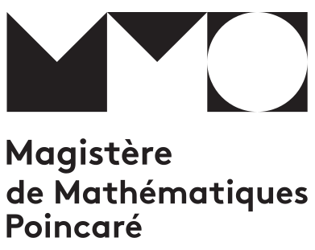

# Séminaire du Magistère de Mathématiques Poincaré de Nancy : programme 26-27

Cette page récapitulel le programme 2026-2027 du «séminaire du magistère» de Nancy, un séminaire (type colloquium) créé pour les étudiants du Magistère de mathématiques et de Licence de mathématiques.

> Pour plus d'informations sur le magistère de mathématiques de Nancy, une formation sélective sur trois recrutant en sortie de L2 ou CPGE (MP/MP*/PC*), voir les pages officielles sur le site de l'IECL <https://iecl.univ-lorraine.fr/magistere-poincare/> (lien le plus à jour) ou de la faculté de sciences <https://fst.univ-lorraine.fr/formations/magistere-de-mathematiques-poincare/>.

## Date : orateur/ice

### Titre

Résumé

