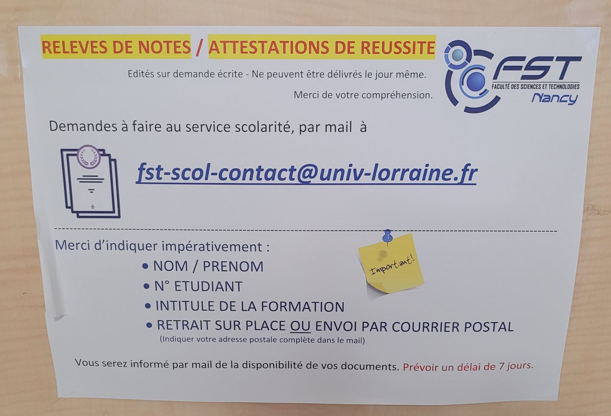

Comment retirer son diplôme ou obtenir un relevé de notes
==========================

Attention, à lire impérativement *avant* de passer à la scol pour ne pas perdre de temps :

Lorsque le diplôme est prêt à être retiré (en cours d'année suivant la L3), il y a plusieurs façons de le récupérer. Le diplôme peut être récupéré à la scolarité (par vous-même, ou par un proche disposant d'une procuration), ou bien envoyé par la poste en recommandé (après une demande soit par courrier, soit par email).

Ces quatre procédures sont détaillées ci-dessous :

Récupération en mains propres
---
 
Vous pouvez venir retirer votre diplôme directement à la scolarité – Bureau Licences/Masters sur présentation d'une pièce d'identité.
(Du lundi au vendredi de 13h00 à 16h30 ou le matin uniquement sur rdv)

Procuration à une personne qui vient le récupérer
---
 
Vous pouvez donner procuration à une personne de votre choix.
Le jour du retrait, la personne devra nous fournir : 
- Sa propre pièce d'identité
- La copie de votre pièce d'identité
- La procuration 
 
Envoi en recommandé, demande par courrier (vers la France, ou vers l'étranger)
---

Il faut fournir :
 
- la copie de votre pièce d'identité
- l'intitulé du diplôme, l'année d'obtention et l'adresse postale complète à laquelle vous souhaitez recevoir votre diplôme
- un timbre
 (Tarif lettre recommandée 50gr)

Envoi en recommandé, demande par mail (plus rapide, mais de France à France uniquement)
---

Envoyer :
 
- la copie de votre pièce d'identité
- l'intitulé du diplôme, l'année d'obtention
- un timbre électronique acheté sur le site  [https://www.laposte.fr/vignette-recommandee-en-ligne](https://www.laposte.fr/vignette-recommandee-en-ligne)

en précisant, lors de l'édition du timbre :
 
=> EXPÉDITEUR - indiquer :
MAUFROY Faustine
Faculté des Sciences et Technologies
Service scolarité
Boulevard des Aiguillettes
54500 Vandœuvre
 
=> DESTINATAIRE - indiquer :
votre adresse COMPLÈTE
 
Choisir "jusqu'à 50g" pour le poids ET « dépôt en bureau de poste »

 

